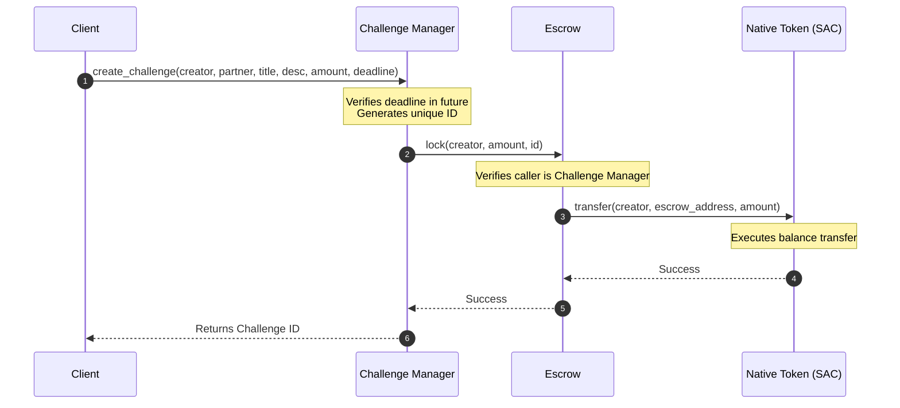

# Architecture Documentation

This document describes the technical layout, component boundaries, and inter-contract mechanics of the Accountability Challenge protocol.

---

## 1. System Boundary Design

The application is structured into two primary layers: the **On-Chain Ledger Layer** and the **Client State Layer**.

```mermaid
graph LR
    subgraph Client State Layer (Browser)
        Zustand[Zustand Stores]
        SWK[StellarWalletsKit]
    end

    subgraph On-Chain Ledger Layer (Stellar Testnet)
        CM[Challenge Manager]
        ES[Escrow Vault]
        SAC[Stellar Asset Contract]
    end

    Zustand -->|JSON-RPC queries| CM
    SWK -->|Sign & Submit TXs| CM
    CM -->|Inter-Contract Call| ES
    ES -->|Token movements| SAC
```

---

## 2. On-Chain Ledger Layer

The smart contract layer consists of two Soroban contracts compiled to WASM and deployed on the Stellar Testnet.

### 1. Challenge Manager Contract
* **Role**: Primary router and state register.
* **Storage Profile**: Persistent storage for challenges to prevent ledger expiration of active goals. Instance storage for metadata (Admin, Escrow address, and Token SAC address).
* **Key Behavior**: When a user creates a challenge, the Challenge Manager contract computes the challenge ID, stores the challenge parameters, and triggers a `lock` call to the Escrow contract.

### 2. Escrow Contract
* **Role**: Asset vault.
* **Storage Profile**: Instance storage (Manager Contract address and Token SAC address).
* **Key Behavior**: Restricts call access. Only the Challenge Manager contract can invoke `lock` and `release` methods. It interacts directly with the Native Token Stellar Asset Contract (SAC) to execute transfer operations.

---

## 3. Client State Layer

The client application is built on Next.js 15 using a modular, feature-oriented structure.

### 1. Zustand Stores (Local State Machine)
* **Wallet Store (`useWalletStore`)**: Tracks active account public key, connection status, wallet branding choice (Freighter/Albedo/xBull), and connection errors.
* **Challenge Store (`useChallengeStore`)**: Maintains challenge lists, currently inspected details, loading progress indicators, and logs confirmation transaction hashes.
* **Transaction Store (`useTransactionStore`)**: Persists transaction histories locally (XDR payloads, hashes, execution statuses, action types) to maintain a persistent audit trail.
* **Settings Store (`useSettingsStore`)**: Tracks user preference settings (refresh intervals, theme modes, alerts status).
* **Analytics Store (`useAnalyticsStore`)**: Computes analytics metrics (Won vs Lost XLM, success rates, active goals count) locally.

### 2. Real-Time Syncing (Polling Engine)
* Polling is executed every 5 seconds (configurable to 10s or 30s in Settings).
* Every interval, the client fetches the latest challenge lists from the blockchain RPC.
* At the same time, the client queries contract event logs via `getEvents` to construct a real-time activity feed timeline.

---

## 4. Inter-Contract Call Design

The diagram below details the invocation stack for challenge locking:


* **Authorization Propagations**: The creator signs the transaction envelope. Because the first call is `create_challenge`, Soroban's auth system validates that the signer's signature covers the nested `transfer` call from the creator's address to the escrow. This prevents malicious contracts from locking funds without explicit signature approvals.
