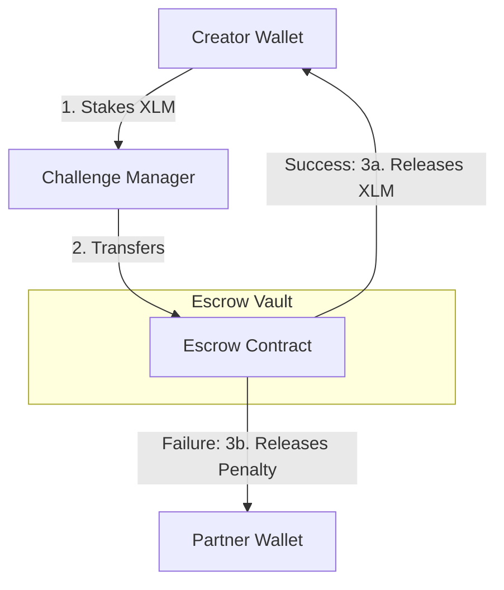

# Project Overview: Accountability Challenge

## 1. Project Vision
The **Accountability Challenge** is a decentralized commitment protocol designed to help individuals accomplish their goals by attaching real economic consequences to failure. By bridging social trust (the peer partner) and smart-contract-enforced logic (the escrow vault), the platform transforms standard promises into immutable, stake-backed commitments on the Stellar blockchain.

## 2. The Core Problem
Most goal-setting mechanisms (such as fitness trackers, calendar reminders, or study journals) fail because they lack **loss-aversion incentives**. Behavioral economics shows that people are significantly more motivated to complete a task if they stand to lose an asset they already own (loss aversion) than if they are simply offered a future reward.

Furthermore, traditional accountability groups rely on manual follow-ups that can be easily avoided or renegotiated. There is no automated, trustless agent to lock stakes and distribute them based on objective rules.

## 3. The Protocol Solution
By locking assets (XLM) in a Soroban smart contract, the commitment is bound to an immutable ledger:
1. **Financial Friction**: Staking XLM creates an immediate financial barrier to failure.
2. **Social Accountability**: The designated Accountability Partner acts as the oracle, holding the sole authority to verify and release the funds back to the creator or award them to themselves as a penalty payout.
3. **Immutability**: Once active, the rules cannot be altered by either party. Only the partner can approve success, and only the creator can voluntarily admit failure before the deadline.

---

## 4. Staking Economics (Token Flow)

The staking mechanics are built around the native Stellar Asset Contract (SAC) representing XLM:

* **Stake Lock**: The user defines an amount $A$ of XLM to lock. This amount is transferred from the user's account to the Escrow contract's balance.
* **Capital Protection (Success)**: If the partner confirms completion, $A$ XLM is transferred back to the creator. The transaction fee is the only cost incurred.
* **Loss Penalty (Failure/Expiry)**: If the creator admits failure, or the deadline passes without the partner verifying completion, the partner can claim $A$ XLM as a reward for their auditing service.

---

## 5. Target Audience

* **Developers & Students**: Commit to study schedules, coding bootcamps, or project releases.
* **Health & Wellness Enthusiasts**: Commit to weight goals, workout streaks, or clean diets.
* **Content Creators**: Commit to publishing schedules, articles, or videos.
* **Web3 Teams**: Commit to building milestones, hackathon submissions, or document drafts.
