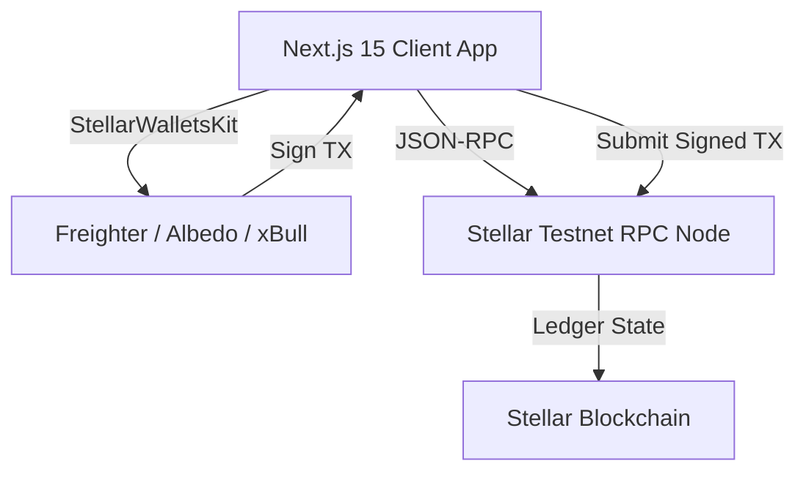
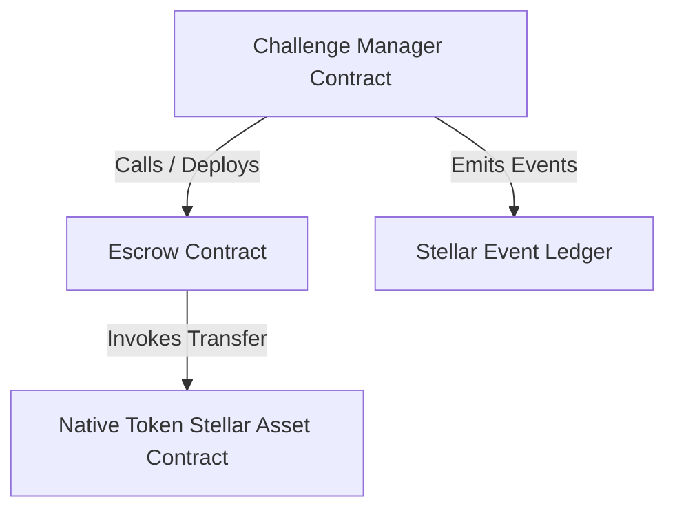
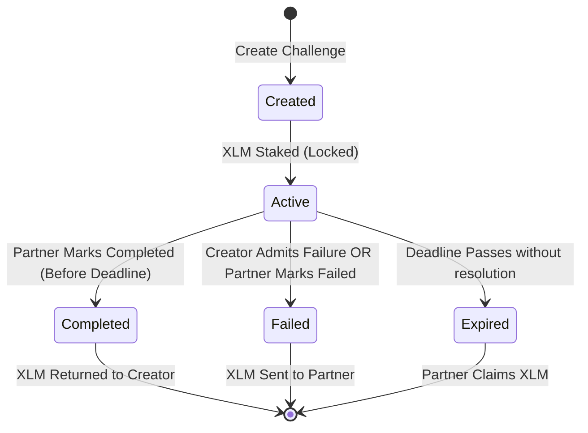
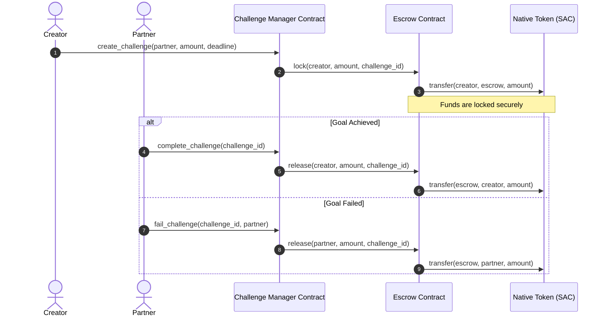

# Accountability Challenge

An escrow-backed, peer-verified commitment protocol built on Stellar and Soroban. Commit to your goals, stake XLM, and get verified by a partner. Perform or pay the price.

---

## 1. Project Overview

### The Problem
Goal setting often fails due to a lack of immediate consequences and real accountability. People make resolutions, but without stake or social checkpoints, commitments are easily abandoned when convenience declines.

### The Solution
The **Accountability Challenge** protocol enforces commitments using economic stakes and peer validation on the blockchain. Users lock XLM into a decentralized escrow contract. The stake is returned if they accomplish their goal before the deadline. If they fail or let the deadline expire, the locked funds are transferred to their designated accountability partner.

---

## 2. Features

* **Challenge Creation**: Specify a title, detailed description, stake amount (XLM), and completion deadline.
* **XLM Staking**: Lock stakes securely in an isolated, contract-managed escrow vault.
* **Accountability Partner System**: Input a partner's public key who holds the exclusive right to release funds or declare completion.
* **Wallet Integration**: Modular adapter kit supporting Freighter, Albedo, and xBull browser extensions.
* **Activity Feed**: Real-time polling of ledger events auditing contract creations, locks, and resolutions.
* **Transaction Center**: Persistence logger tracking XDR hashes, confirmations, and explorer receipts.
* **Analytics Dashboard**: Dynamic metrics showing goal completion rates, active TVL, and total XLM won/lost.
* **Settings Management**: Custom configurations for refresh intervals, notification banners, and cache purges.

---

## 3. Tech Stack

### Frontend
* **Next.js 15 (App Router)**: React Framework for modern static/dynamic routing.
* **TypeScript**: Strong compile-time type safety.
* **Tailwind CSS & shadcn/ui**: Modern aesthetics with HSL-themed variables.
* **Zustand**: Client-side state stores.
* **React Query**: Client data caching.

### Blockchain
* **Stellar & Soroban**: Level 3 smart contracts written in Rust.
* **Stellar Wallets Kit**: Unified interface for Freighter, Albedo, and xBull wallet extensions.
* **@stellar/stellar-sdk**: JS/TS integration client.

### Testing
* **Cargo (Rust)**: Contract unit tests and transaction simulations.
* **Vitest**: Frontend JSDOM unit tests.
* **React Testing Library**: React component assertions.

### CI/CD
* **GitHub Actions**: Automated check pipelines on push/PRs.

---

## 4. Architecture Diagrams

### System Architecture


### Smart Contract Architecture


### Challenge Lifecycle


### Inter-Contract Communication Flow


### Frontend Architecture
```mermaid
graph TD
    Pages[Next.js App Pages] --> UI[shadcn Components]
    Pages --> Zustand[Zustand Stores: Wallet, Challenge, TX, Settings]
    Zustand --> Services[Services: Wallet, Soroban RPC]
    Services --> SDK[@stellar/stellar-sdk]
```

---

## 5. Folder Structure

```text
├── .github/workflows/    # CI/CD pipelines
├── contracts/            # Soroban Smart Contracts (Rust)
│   ├── challenge-manager # Core challenge state manager contract
│   └── escrow            # Dedicated stake holding escrow contract
├── scripts/              # Local Testnet deployment & upgrade scripts
├── src/
│   ├── app/              # Next.js 15 routing pages (Dashboard, Create, Details, etc.)
│   ├── components/       # Shared UI frames (Navbar, Providers, Loader)
│   ├── features/         # Modular feature scopes
│   │   ├── activity/     # Event log adapters, stores, and cards
│   │   ├── analytics/    # Calculations, stores, and stats grids
│   │   ├── challenge/    # RPC services, stores, cards, and detail actions
│   │   ├── settings/     # Local preference stores
│   │   └── wallet/       # Wallets adapter interfaces and persistent stores
│   └── lib/              # Styling utils and class helpers
├── package.json          # Dependency mappings
├── tsconfig.json         # TS config options
├── vitest.config.ts      # JSDOM Vitest test config
└── vitest.setup.ts       # Test library mocks
```

---

## 6. Smart Contract Design

### Challenge Manager Contract
Coordinates user challenges, stores challenge objects in persistent storage, and serves as the authorized coordinator for the Escrow Contract.
* **State Struct**:
  ```rust
  pub struct Challenge {
      pub id: u64,
      pub creator: Address,
      pub title: String,
      pub description: String,
      pub amount: i128,
      pub deadline: u64,
      pub partner: Address,
      pub status: ChallengeStatus,
      pub created_at: u64,
  }
  ```

### Escrow Contract
Holds XLM tokens. It only accepts lock and release invocations from its configured `manager` address.
* **Safety Feature**: The creator authorizes a token transfer from their wallet to the Escrow contract directly. The Escrow contract handles the asset movement safely via the Stellar Asset Contract (SAC).

---

## 7. Local Development Setup

### Prerequisites
* **Rust**: `rustup` stable.
* **Target WASM**: `rustup target add wasm32-unknown-unknown`.
* **Stellar CLI**: version `25.2.0` or higher.
* **Node.js**: version `20` or higher.

### Installation Steps
1. Clone the repository and install npm packages:
   ```bash
   npm install --ignore-scripts
   ```
2. Build the smart contracts:
   ```bash
   stellar contract build
   ```
3. Run the frontend unit/integration tests:
   ```bash
   npm run test
   ```
4. Run the contract unit tests:
   ```bash
   cargo test
   ```
5. Run the frontend locally in development mode:
   ```bash
   npm run dev
   ```

---

## 8. Environment Variables

Create `.env.local` using the template below:
```text
NEXT_PUBLIC_SOROBAN_RPC_URL=https://soroban-testnet.stellar.org
NEXT_PUBLIC_NETWORK_PASSPHRASE="Test SDF Network ; September 2015"
NEXT_PUBLIC_CHALLENGE_MANAGER_CONTRACT_ID=
NEXT_PUBLIC_ESCROW_CONTRACT_ID=
```

---

## 9. Deployment Instructions

1. Configure the Stellar network profile and generate a funded deployer keypair:
   ```bash
   stellar network add --global testnet --rpc-url "https://soroban-testnet.stellar.org" --network-passphrase "Test SDF Network ; September 2015"
   stellar keys generate --network testnet deployer
   ```
2. Run the deployment automation script:
   ```bash
   node scripts/deploy.js
   ```
   *This script compiles the contracts, deploys them to Testnet, runs initializations, and writes the addresses to `.env.local`.*

---

## 10. Security Considerations

* **Access Control**: Only the configured accountability partner can mark a challenge `Completed` or claim expired funds.
* **Voluntary Admits**: The creator can voluntarily admit failure at any point to release stakes to the partner immediately.
* **Authorized Escrow Locks**: The Escrow contract only permits locks and releases invoked by the Challenge Manager contract.
* **Sanitization**: Inputs on titles, descriptions, and stake numbers are sanitized and verified before ledger transactions.

---

## 11. Deployed Addresses (Stellar Testnet)

* **Challenge Manager Contract ID**: `[PLACEHOLDER: Deployed Contract ID]`
* **Escrow Contract ID**: `[PLACEHOLDER: Deployed Contract ID]`

---

## 12. Verification & Explorer Receipts

* **Deployment Transaction Hash**: `[PLACEHOLDER: Deploy TX Hash]`
* **Explorer Link**: `https://stellar.expert/explorer/testnet/tx/[PLACEHOLDER: Deploy TX Hash]`

---

## 13. Interface Screenshots

### Landing Page
`[PLACEHOLDER: Landing Page screenshot]`

### Dashboard
`[PLACEHOLDER: Dashboard screenshot]`

### Create Challenge Form
`[PLACEHOLDER: Create Challenge screenshot]`

### Challenge Details View
`[PLACEHOLDER: Challenge Details screenshot]`

### Activity Feed
`[PLACEHOLDER: Activity Feed screenshot]`

### Transaction Center
`[PLACEHOLDER: Transaction Center screenshot]`

### Analytics Summary
`[PLACEHOLDER: Analytics screenshot]`

### Settings Preferences
`[PLACEHOLDER: Settings screenshot]`

---

## 14. Demo Links

* **Live Web App Demo**: `[PLACEHOLDER: Live App Link]`
* **Video Walkthrough Demo**: `[PLACEHOLDER: Video Link]`
